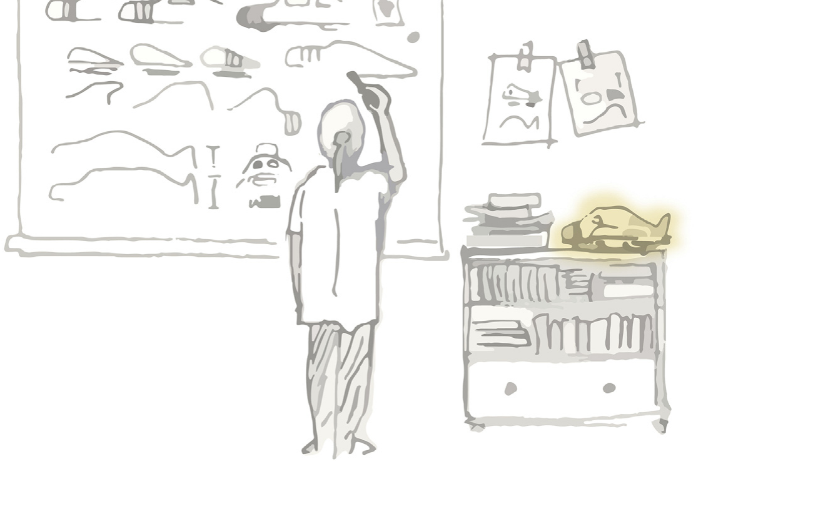

# On Design Fixation

*Published 20-04-2026*

When I first started writing the software for [Luciferin](/luciferin-pt3), the custom motor controller I built for Firefly's Greenpower car, one of the strategies I considered was controlling motor current using PID. I had a target current, a measured current and a PWM duty cycle that I could adjust, which looked sufficiently like a control problem that reaching for a PID controller felt almost compulsory.

This was not an entirely unreasonable idea. PID control is widely used, relatively easy to implement and, when applied to the right system, can prove to be extremely effective. It was also the most sophisticated control technique I knew at the time, which perhaps had more influence over the decision than I would have liked to admit. To a sixteen-year-old who had recently watched a YouTube video and read half a Wikipedia article, the temptation to use this interesting new technology was too great to resist.

I implemented the controller and spent some time attempting to make it behave. The proportional term reacted to changes in current, the integral term accumulated error and the derivative term mostly amplified noise while giving me another constant to adjust. On paper, the structure made sense. In practice, it was solving a more elaborate version of the wrong problem.

The controller did not need perfect steady-state current regulation. The driver still controlled the car through the throttle, and the software's role was primarily to prevent abrupt increases in demand from producing large current spikes. Those spikes mattered because the lead-acid batteries used in Greenpower lose usable capacity disproportionately at high discharge currents. Once the problem was framed in those terms, the solution became much simpler: limit the rate at which throttle demand can increase, allow it to fall immediately, and use proportional feedback to constrain excessive current.

Looking back, the interesting part is not that my first solution was imperfect. Almost every first solution is imperfect, especially when it is being developed by somebody whose main qualification is having recently read the relevant Wikipedia page. The interesting part is how quickly PID stopped being a possible solution and became part of my understanding of the problem itself. Instead of asking how the controller should protect the battery, I had begun asking how I should design the PID controller that would protect the battery.

This is an example of design fixation: the tendency for an existing idea, precedent or familiar technique to restrict the range of solutions that a designer considers. The term was introduced by David Jansson and Steven Smith in their 1991 paper, [*Design fixation*](https://www.sciencedirect.com/science/article/abs/pii/0142694X9190003F), in which they investigated whether exposure to an example could measurably constrain conceptual design.

In one of their experiments, participants were asked to design a disposable, spill-proof coffee cup. Some were also shown an example design containing several deliberately problematic features, and the accompanying description explicitly identified those problems. Despite knowing that the features were flawed, participants exposed to the example reproduced them in their own designs more frequently than those who had not seen it. The example did not merely give them something to evaluate; it altered which solutions were easiest to imagine.

This is what makes fixation more subtle than simply refusing to change one's mind. Somebody who knowingly chooses one approach after comparing several alternatives has made a design decision. Somebody who unconsciously treats the first available approach as the boundary of the problem has allowed the decision to be made for them. From the outside these can look very similar, especially once enough work has been invested in making the chosen approach appear inevitable.

*Figure 1 — Existing solutions are difficult to unsee. Illustration by Paul Margiotta, from [Crilly and Cardoso (2017)](https://doi.org/10.1016/j.destud.2017.02.001); cropped.*

Fixation can begin with an external example, as it did in the coffee-cup experiment, but an example is not required. Designers can become attached to ideas they generated themselves, to methods that worked on previous projects or to assumptions embedded in the tools they use. In engineering, this often happens when a requirement is written in terms of an implementation. A specification that says a system must measure position leaves several options available; a specification that says it must use a particular encoder has already performed part of the design process, whether intentionally or not.

I encountered a similar problem while developing the [electronic gear shifter](/making-gear-shifts-boring) for Manchester Stinger Motorsports. My original plan was to perform the entire shift from the GPIO interrupt raised by the driver's paddle. The appeal was straightforward: the request would arrive, the interrupt would take control and nothing else could interfere until the gearbox had moved. It was an attractively direct model, rather like ensuring a meeting remains focused by locking everybody else out of the building.

Unfortunately, a gear shift is a relatively long mechanical event, while interrupt handlers are intended to complete quickly. Waiting for an actuator and repeatedly reading an encoder from interrupt context would have interfered with timers, watchdog servicing and driver code that quite reasonably expects the rest of the processor to remain alive. The final implementation reduced the interrupt's role to capturing the request, disabling further shift inputs and waking a high-priority task that owns the actuator.

Again, the first idea was not absurd. It followed from a legitimate requirement that the active shift should not be interrupted by unrelated work. The fixation occurred because I committed too early to one interpretation of that requirement: if the operation must not be interrupted, perhaps it should happen inside an interrupt. Once phrased that way, the implementation sounds almost inevitable, which is normally a useful warning that the wording has started doing more design work than the evidence.

It would be convenient if experience removed this tendency, but the available research does not support such a comforting conclusion. A [2011 study comparing novice and experienced designers](https://dfam.designsociety.org/publication/30686/UNDERSTANDING%2BFIXATION%3A%2BA%2BSTUDY%2BON%2BTHE%2BROLE%2BOF%2BEXPERTISE) found that experts produced more ideas, but were no less susceptible to fixation on the supplied example. Nathan Crilly's later interviews with thirteen professional designers, published as [*Fixation and creativity in concept development*](https://www.repository.cam.ac.uk/items/f6ea38af-fca1-493f-ad14-3a0f95a069a8), also found that fixation was recognised as a real feature of professional practice. The designers described it as something influenced by clients, teams, organisational culture, previous failures and the methods used during development.

Expertise provides a larger collection of patterns from which to work, making it possible to recognise problems and produce credible solutions quickly. The same collection can also become a set of well-worn routes through the design space. A novice may struggle because they do not know an appropriate solution, while an expert may struggle because they know one immediately. Experience is therefore neither the cause nor the cure; its effect depends on whether familiar patterns are being used as candidates or accepted as conclusions.

There is also a risk of becoming so concerned about fixation that every use of precedent begins to look intellectually suspect. Designing without examples is neither realistic nor especially desirable. Most engineering progress depends on reusing components, architectures and principles that have already survived contact with reality. Refusing to consult previous work would avoid being anchored by it, although it would also be an excellent way to spend six months rediscovering the flyback diode.

The distinction between inspiration and fixation is not simply whether an example influenced the result. A design can borrow heavily from an existing solution for good reasons, while a visually different design can still be constrained by the same underlying assumptions. What matters is whether the influence helps the designer explore and evaluate the problem or causes useful alternatives to disappear before they have been considered.

Research on this point is more complicated than the common advice to avoid looking at examples. A 2015 meta-analysis by Ut Na Sio, Kenneth Kotovsky and Jonathan Cagan, [*Fixation or inspiration?*](https://www.sciencedirect.com/science/article/abs/pii/S0142694X15000290), combined results from 43 design studies. Examples generally caused participants to explore a narrower range of ideas, but they could also improve the novelty and quality of the resulting designs. In particular, a single unusual example could encourage a deeper search in a less obvious part of the solution space.

This apparent contradiction is quite useful. Breadth, novelty and quality are related, but they are not interchangeable. An example may reduce the number of fundamentally different directions considered while helping somebody develop one direction more effectively. Whether this is beneficial depends on when the example is introduced, how closely it resembles the problem and whether the task currently requires exploration or refinement. Looking at existing motor controllers while selecting a power-stage topology might anchor the architecture prematurely; looking at their gate-drive circuits after choosing a topology might prevent an entirely avoidable fried MOSFET.

> **Aside — Learning can be an objective**
>
> There is a similar qualification for projects undertaken partly as an opportunity to learn. If one of the objectives is to gain experience with an interesting technology, then using that technology becomes part of the design brief, even if a simpler or more conventional solution would satisfy the purely functional requirements. Building something around an FPGA when a microcontroller would have been perfectly adequate is not necessarily poor engineering if learning Verilog was one of the reasons for starting the project. The important distinction is whether that objective has been acknowledged or whether the technology was selected first and justified retrospectively. Not every personal project needs to optimise cost, complexity and development time as though it were about to enter mass production; if it did, most would conclude with the purchase of an off-the-shelf module and very little would be learnt. Curiosity is a legitimate constraint, provided it appears honestly among the objectives against which the design is evaluated.

There is no single method that guarantees freedom from fixation, and some proposed remedies are less reliable than they first appear. Telling somebody not to copy an example can still leave the example occupying most of their attention, while taking a short break does not necessarily cause an alternative architecture to materialise during a cup of tea. The broader review by Luis Vasconcelos and Nathan Crilly, [*Inspiration and fixation: Questions, methods, findings, and challenges*](https://www.repository.cam.ac.uk/items/ab1d3c24-a060-4dc1-bee2-f27873e3e883), found substantial variation in both experimental methods and outcomes, so grand claims about a universal process for becoming more creative should be treated with some suspicion.

There are, however, several habits that make premature commitment easier to detect. The first is to write requirements without unnecessarily naming their implementation. "The controller must determine the actuator position after power loss" describes a need; "the controller must use an absolute SPI encoder" describes one way of meeting it. The second statement may eventually be the correct decision, but placing it in the requirements removes the point at which that decision would otherwise be examined.

It is also useful to generate alternatives that differ in principle rather than merely in detail. Producing five versions of the same half-bridge is not equivalent to considering five architectures. For the motor controller, meaningful alternatives might have included regulating current directly, limiting its rate of change, constraining delivered power or leaving control to the driver while logging the consequences. Several of these may be unsuitable, but explaining why they are unsuitable gives the selected approach a stronger foundation than simply producing more sketches of the first idea.

Changing the representation of a problem can help expose assumptions that were hidden by the previous one. A schematic emphasises electrical connectivity, a block diagram emphasises information flow and a written sequence emphasises behaviour over time. The gear-shifter interrupt design looked pleasingly simple as a sequence of events, but much less attractive when represented as a list of everything that would need to happen while the processor remained in interrupt context. No representation is neutral, so moving between several is often more useful than attempting to make one increasingly detailed.

Finally, design reviews should question the framing as well as the implementation. Asking whether the code correctly implements a PID controller is a different question from asking why the system contains one. By the time a project reaches a detailed review, the most consequential decisions may already be disguised as context. An outside reviewer is valuable partly because they have not spent several weeks turning those decisions into facts.

None of this is an argument for keeping every possibility open indefinitely. Engineering requires commitment, otherwise every project ends with an impressive collection of alternatives and a car that remains stationary. Exploration has a cost, deadlines are real and a sufficiently good familiar solution is often preferable to an ingenious untested one.

I still use PID controllers, interrupts, reference designs and all the other ideas that have caused me to fixate at various points. None of these concepts is inherently problematic. The issue arises when a familiar solution arrives so early that it becomes difficult to separate from the requirement it is supposed to satisfy.
